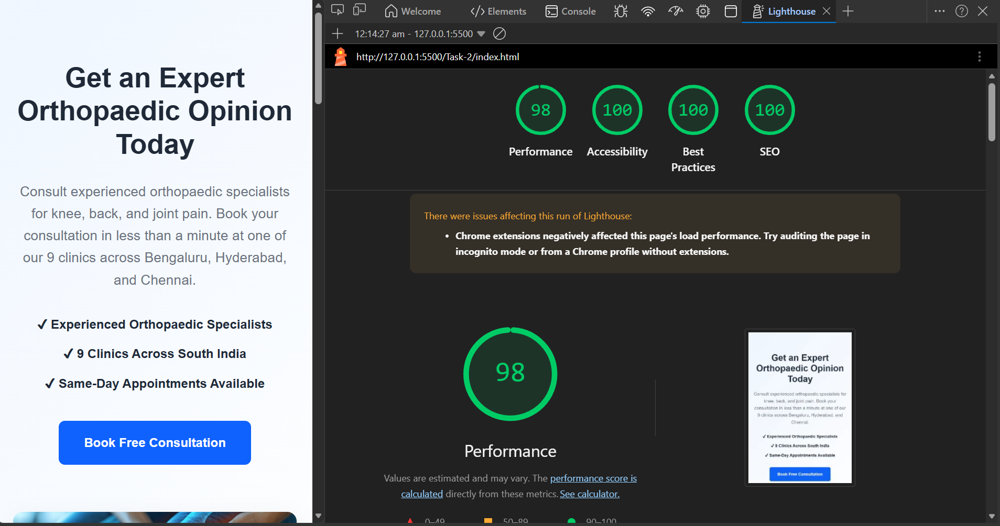

# Namoza Developer Assignment

This repository contains my submission for the Namoza Developer Assignment. The project demonstrates frontend development, Google Tag Manager (GTM) event tracking design, and CRM/marketing integration architecture for a healthcare landing page.

---

## Project Structure

```
Namoza-Developer-Assignment/
│
├── README.md
│
├── Task-1/
│   └── schema.md
│
├── Task-2/
│   └── index.html
│
└── Task-3/
    └── integration.md
```

---

# Task 1 – Google Tag Manager Event Tracking Schema

Designed a scalable GTM event tracking architecture for the OrthoNow healthcare website.

### Features

- GTM event tracking strategy
- Booking funnel tracking
- Custom event schema
- GA4 event mapping
- Google Ads conversion tracking
- Sample `dataLayer.push()` implementation
- Funnel analysis strategy

---

# Task 2 – Responsive Landing Page

Developed a responsive healthcare landing page using HTML, CSS, and JavaScript.

### Features

- Responsive layout
- Hero section
- Benefits section
- Trust section
- Consultation form
- Client-side form validation
- Thank-you message without page reload
- Google Tag Manager `dataLayer.push()` implementation
- Mobile-friendly design

### Technologies Used

- HTML5
- CSS3
- JavaScript (ES6)

---

# Task 3 – CRM & Marketing Integration Design

Designed the backend integration architecture for processing consultation requests.

### Integrations

- HubSpot CRM
- Karix WhatsApp API
- Google Analytics 4
- Google Ads Conversion Tracking

### Includes

- System architecture
- Integration flow
- Error handling strategy
- Security considerations
- Monitoring and logging

---

# Google Tag Manager Event

The landing page simulates a GTM implementation using the JavaScript `dataLayer`.

Example event:

```javascript
window.dataLayer.push({
    event: "consultation_form_submitted",
    clinic_location: "Bengaluru",
    device_type: "desktop",
    lead_source: "landing_page"
});
```

---

# How to Run

1. Clone the repository.

```bash
git clone <repository-url>
```

2. Open the project folder.

3. Navigate to the `Task-2` directory.

4. Open `index.html` in a web browser or run it using the Live Server extension in Visual Studio Code.

---

# Future Improvements

- Backend API integration
- HubSpot API implementation
- Karix WhatsApp API integration
- Google Tag Manager container configuration
- Google Analytics 4 property configuration
- Database integration
- Appointment scheduling backend

---

## PageSpeed Insights

A mobile performance report was generated using Google Lighthouse/PageSpeed Insights.



# Author

**Ishita Verma**

Submission for the **Namoza Developer Assignment**.